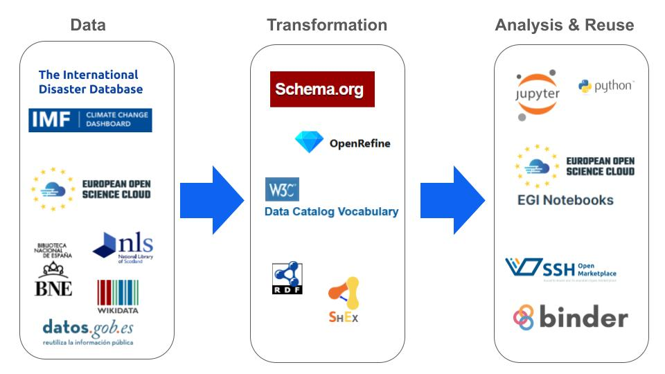

# environmental-data-space
Towards an environmental data space

## Introduction
This is the code repository for the use case based on the enviroment data space to address issues such as climate change and disasters. This project intends to provide best practices and guidelines to create a environment data space. A framework will be developed to reuse open data made available by different type of institutions such as open data portal, Cultural Heritage institutions and public and collaborative-edition repositories such as Wikidata.

## Previous work
This approach is based on previous and open source work based on the use of Jupyter Notebooks to provide reproducible code and in the context of several national and international  projects, organisations, webinars and research articles. The list of open source repositories are listed below.

- [Linked Open Data visualization in Cultural Heritage](https://github.com/hibernator11/visual-ch-lod)
- [National Librarian’s Research Fellowship in Digital Scholarship 2022-23](https://github.com/hibernator11/nls-fellowship-2022-23)
- [Linked Open Data and SPARQL](https://github.com/hibernator11/hdh-compartir-pantalla-2023)
- [Linked Open Data in Cultural Heritage](https://github.com/hibernator11/shexer-CH)
- [DCAT-GLAM-catalog](https://github.com/hibernator11/dcat-glam-catalog)
- [Learning Python](https://github.com/hibernator11/AprendiendoPython) 

## Architecture
The following architecture will be implemented and used to explore new ways of data analysis and visualisation.

## References

- Candela, G. An automatic data quality approach to assess semantic data from cultural heritage institutions. J. Assoc. Inf. Sci. Technol. 74(7): 866-878 (2023)
- Candela, G., Chambers, S. Sherratt, T. An approach to assess the quality of Jupyter projects published by GLAM institutions. J. Assoc. Inf. Sci. Technol. 74(13): 1550-1564 (2023)
- Candela, G., et al. (2023), "A checklist to publish collections as data in GLAM institutions", Global Knowledge, Memory and Communication, Vol. ahead-of-print No. ahead-of-print. https://doi.org/10.1108/GKMC-06-2023-0195
-  Candela, G. (2023). Towards a semantic approach in GLAM Labs: The case of the Data Foundry at the National Library of Scotland. Journal of Information Science (20239. https://doi.org/10.1177/01655515231174386
